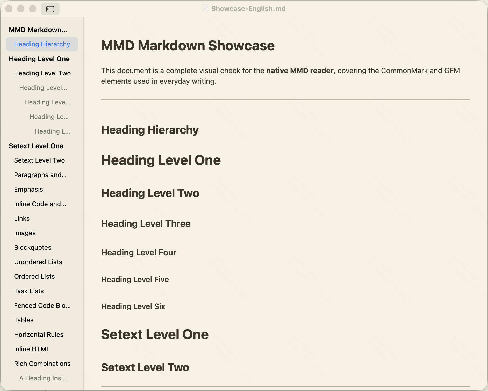

<div align="center">

# MMD

### Markdownを読む。ただ、それだけに集中する。

AppKitとTextKitで作られた、WebViewを使わない軽量なmacOSネイティブMarkdownリーダーです。

[](https://www.apple.com/jp/macos/)
[](https://www.swift.org/)
[](https://developer.apple.com/documentation/appkit)
[](#mmdを選ぶ理由)

[English](README.md) · [简体中文](README.zh-CN.md) · **日本語**

</div>

---

<p align="center">
  
</p>

<p align="center"><em>紙テーマ、英語のMarkdownショーケース、そしてネイティブな目次。</em></p>

## MMDを選ぶ理由

MMDは、**Markdownファイルを開いて、すぐに読み始めたい**人のために作られています。アプリ内にブラウザを組み込まず、macOSのネイティブなテキスト描画を使うことで、軽快で集中しやすい読書体験を実現します。

- **本物のネイティブ体験** — AppKit、TextKit 2、標準のmacOSウインドウ、メニュー、テキスト選択、コピー、リンク、検索
- **小ささを重視** — 検証済みのUniversal 2アプリバンドルは約**2.7 MB**
- **読むことに集中** — 折りたためる目次、文字サイズ調整、システムテーマと紙テーマ
- **ローカルファイルに強い** — Finder、ファイル選択、ドラッグ＆ドロップに対応し、相対パスのローカル画像も表示
- **ブラウザを内蔵しない** — WebViewもJavaScriptランタイムも不使用

## 主な機能

| ネイティブな読書体験 | Markdown対応 | 便利な操作 |
| --- | --- | --- |
| TextKit 2による組版 | 見出しと強調 | Finderとファイル選択 |
| 選択、コピー、検索、リンク | リストとタスクリスト | ドラッグ＆ドロップ |
| システムテーマと紙テーマ | 表、引用、区切り線 | 折りたためる目次 |
| 文字サイズ調整 | コードブロックとインラインコード | ローカル画像とネットワーク画像 |

MMDはUTF-8、BOM付きUTF-8、UTF-16の文書を読み込めます。`.md`と`.markdown`ファイルに対応しています。

> [!NOTE]
> MMDは現在、開発初期段階の読み取り専用リーダーです。HTMLブロック、Mermaid、LaTeX、コードのシンタックスハイライトにはまだ対応していません。

## クイックスタート

### 必要な環境

- macOS 13 Ventura以降
- XcodeおよびCommand Line Tools

### ビルドして開く

```bash
git clone https://github.com/imxv/mmd.git
cd mmd
swift test
./scripts/build_app.sh
open dist/MMD.app
```

デフォルトではApple Silicon向けにビルドします。Apple SiliconとIntel Macの両方に対応するUniversal 2版を作るには、次を実行します。

```bash
MMD_UNIVERSAL=1 ./scripts/build_app.sh
```

ビルドスクリプトは`dist/MMD.app`を生成し、デバッグシンボルを削除してad-hoc署名を行います。一般公開するには、別途Developer ID署名とAppleの公証が必要です。

## MMDの使い方

1. MMDを開いてMarkdownファイルを選ぶか、ウェルカムウインドウへファイルをドラッグします。
2. 目次から見出し間をすばやく移動します。
3. 「表示」メニューから文字サイズを変更し、システムテーマと紙テーマを切り替えます。

便利なショートカット：

| 操作 | ショートカット |
| --- | --- |
| 文書を開く | <kbd>⌘ O</kbd> |
| 文書内を検索 | <kbd>⌘ F</kbd> |
| 目次を表示／非表示 | <kbd>⌘ 0</kbd> |
| 文字を拡大／縮小 | <kbd>⌘ +</kbd> / <kbd>⌘ −</kbd> |
| 紙テーマを切り替える | <kbd>⌥ ⌘ T</kbd> |

## 技術構成

MMDはSwift Packageの実行可能プログラムとして、次の技術で構成されています。

- **AppKit** — アプリケーションとネイティブ文書ウインドウ
- **TextKit 2** — テキストのレイアウトと操作
- **swift-markdown / cmark-gfm** — Markdownの解析
- **FoundationとImageIO** — ファイルのデコードと画像の読み込み

サードパーティーのランタイムフレームワークには依存していません。パーサーのライセンス表記はパッケージング時にアプリバンドルへコピーされます。

## 開発

テストを実行：

```bash
swift test
```

Releaseアプリバンドルを作成：

```bash
./scripts/build_app.sh
```

コントリビューションや、焦点の明確な不具合報告を歓迎します。描画の問題を報告する際は、macOSのバージョン、Macのアーキテクチャ、最小限のMarkdownサンプルを添えてください。

---

<div align="center">

静かでネイティブなmacOS読書体験のために。

</div>
