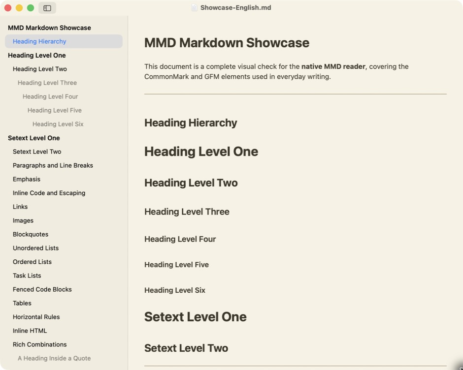

<div align="center">

# MMD

### 阅读 Markdown，不让其他东西打扰你。

一款小巧的 macOS 原生 Markdown 阅读器——基于 AppKit 与 TextKit，不使用 WebView。

[](https://www.apple.com.cn/macos/)
[](https://www.swift.org/)
[](https://developer.apple.com/documentation/appkit)
[](#为什么选择-mmd)

[English](README.md) · **简体中文** · [日本語](README.ja.md)

</div>

---

<p align="center">
  
</p>

<p align="center"><em>纸张主题、英文 Markdown 示例，以及原生标题目录。</em></p>

## 为什么选择 MMD？

MMD 为“**打开 Markdown，马上开始阅读**”而生。它没有在应用里塞进一个浏览器，而是直接使用 macOS 原生文本渲染，带来更轻、更快、更专注的阅读体验。

- **真正原生**——使用 AppKit、TextKit 2，以及标准的 macOS 窗口、菜单、文本选择、复制、链接与查找体验
- **小巧克制**——实测 Universal 2 应用包约 **2.7 MB**
- **专注阅读**——可折叠标题目录、正文字号调节、系统与纸张主题
- **本地友好**——支持 Finder、打开面板和拖拽打开，相对路径本地图片可直接显示
- **没有浏览器外壳**——不使用 WebView，也不包含 JavaScript 运行时

## 功能亮点

| 原生阅读体验 | Markdown 支持 | 日常便利功能 |
| --- | --- | --- |
| TextKit 2 排版 | 标题与文本强调 | Finder 与打开面板 |
| 选择、复制、查找与链接跳转 | 列表与任务列表 | 拖拽打开 |
| 系统与纸张主题 | 表格、引用与分隔线 | 可折叠标题目录 |
| 正文字号调节 | 代码块与行内代码 | 本地与网络图片 |

MMD 支持 UTF-8、带 BOM 的 UTF-8 和 UTF-16 文档，可打开 `.md` 与 `.markdown` 文件。

> [!NOTE]
> MMD 目前仍处于早期阶段，是一款只读阅读器。HTML block、Mermaid、LaTeX 和代码语法高亮暂未实现。

## 快速开始

### 环境要求

- macOS 13 Ventura 或更高版本
- Xcode 及 Command Line Tools

### 构建并打开

```bash
git clone https://github.com/imxv/mmd.git
cd mmd
swift test
./scripts/build_app.sh
open dist/MMD.app
```

默认构建 Apple Silicon 版本。如需同时支持 Apple Silicon 与 Intel Mac，可构建 Universal 2 版本：

```bash
MMD_UNIVERSAL=1 ./scripts/build_app.sh
```

构建脚本会生成 `dist/MMD.app`、剥离调试符号并执行 ad-hoc 签名。正式公开分发前，仍需使用 Developer ID 签名并完成 Apple 公证。

## 使用 MMD

1. 打开 MMD 后选择 Markdown 文件，或将文件拖入欢迎窗口。
2. 使用标题目录在各章节间快速跳转。
3. 从“显示”菜单调整正文字号，或切换系统/纸张主题。

常用快捷键：

| 操作 | 快捷键 |
| --- | --- |
| 打开文档 | <kbd>⌘ O</kbd> |
| 在文档中查找 | <kbd>⌘ F</kbd> |
| 显示/隐藏标题目录 | <kbd>⌘ 0</kbd> |
| 放大/缩小文字 | <kbd>⌘ +</kbd> / <kbd>⌘ −</kbd> |
| 切换纸张主题 | <kbd>⌥ ⌘ T</kbd> |

## 技术实现

MMD 是一个 Swift Package 可执行程序，主要使用：

- **AppKit**：应用与原生文档窗口
- **TextKit 2**：文本排版与交互
- **swift-markdown / cmark-gfm**：Markdown 解析
- **Foundation 与 ImageIO**：文件解码与图片加载

应用不依赖第三方运行时框架。打包时会将解析器的许可证说明复制到应用包内。

## 开发

运行测试：

```bash
swift test
```

构建 Release 应用包：

```bash
./scripts/build_app.sh
```

欢迎提交贡献与范围明确的问题反馈。反馈渲染问题时，请附上 macOS 版本、Mac 芯片架构和一份最小化 Markdown 示例。

---

<div align="center">

为安静、原生的 macOS 阅读体验而生。

</div>
